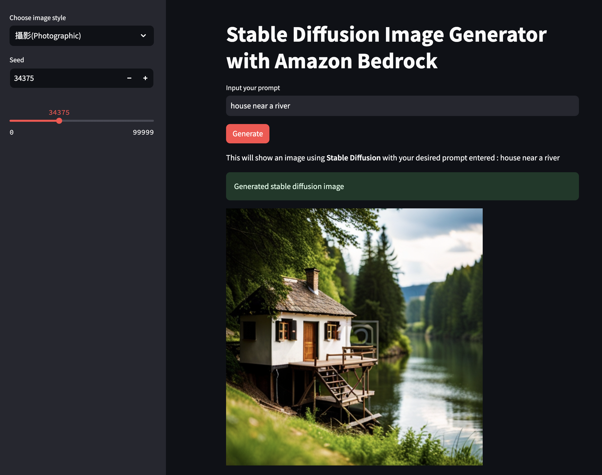

Image Generator with Stable Diffusion on Amazon Bedrock using Streamlit
===

This is a Web Application based on [Streamlit](https://streamlit.io/), which leverage Stable Diffusion model provided by Amazon Bedrock. It is deployed as containers and target to deploy to Amazon ECS for production use.




## Prequisite
1. Docker environment
2. docker-compose installed - Optional for local development only
3. [Copilot CLI](https://aws.github.io/copilot-cli/) for Amazon ECS deploy
4. AWS permissions, for both local development and your applicaiton 
5. Apart from the permissions, you should also enable the Stable Diffusion model

## Local Development

1. Configure the variable
```
cp env-example .env
```
Update the AWS Credentials inside `.env`

2. Run
```
docker-compose up --build
```

## Deploy to Amazon ECS

1. Init the project (First time only)
```
copilot init
```

2. Deploy
```
copilot deploy
```

## Security

See [CONTRIBUTING](CONTRIBUTING.md#security-issue-notifications) for more information.

## License

This library is licensed under the MIT-0 License. See the LICENSE file.
